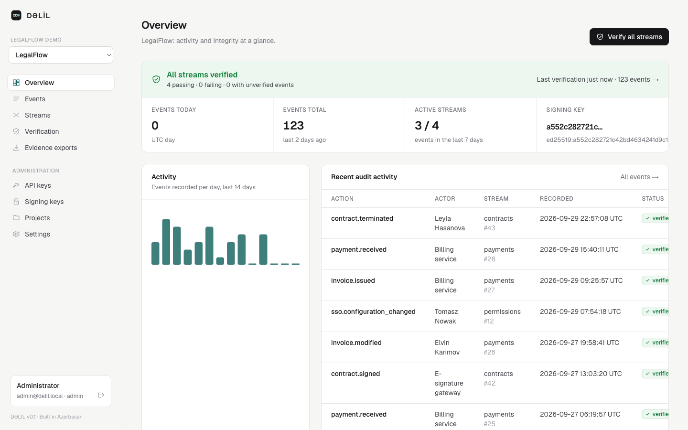
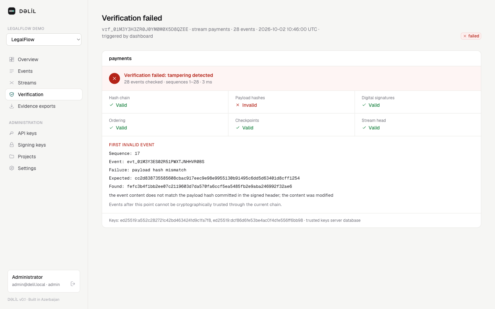

<div align="center">

# DƏLİL

**Cryptographically verifiable audit infrastructure**

Record audit events your users, auditors and courts can verify independently.
Every change, deletion, insertion or reordering is detected and pinpointed.

[](https://github.com/serxan22/delil/actions/workflows/ci.yml)
[](https://github.com/serxan22/delil/actions/workflows/security.yml)
[](LICENSE)

English | [Azərbaycanca](./README.az.md)

</div>

---

*Dəlil* is Azerbaijani for "evidence". Most audit logs are rows in a database
that anyone with enough access can quietly edit. DƏLİL makes that edit
**detectable**. Each event is canonicalized (RFC 8785), hashed (SHA-256),
linked to the previous event in its stream and signed (Ed25519). Verification
recomputes all of it and tells you exactly which record was changed and how,
and it can run on the auditor's own machine, without trusting the server.

```text
$ delil verify --stream payments --trusted-keys trusted-keys.json     # output abridged

Hash chain:         VALID
Payload hashes:     INVALID
Digital signatures: VALID
Tampering detected: YES

First invalid event:
  Sequence:  17
  Failure:   payload hash mismatch
  Detail:    the event content does not match the payload hash committed in the
             signed header; the content was modified
```

## Features

- **Tamper-evident streams.** Per-stream hash chains with Ed25519 signatures,
  signed checkpoints, key rotation and revocation. Detects modified content,
  actors or timestamps, deleted, inserted, swapped and reordered events,
  forged signatures, truncation and (with witnesses) rollback.
- **Independent verification.** The `delil` CLI downloads the raw chain and
  verifies it locally against pinned public keys. A compromised server cannot
  fake a passing result.
- **Offline evidence packages.** Signed ZIP exports with selective disclosure:
  prove that specific events sit in an intact chain without revealing the
  rest. `delil verify-export` needs no server and no database.
- **Built for production.** PostgreSQL with append-only triggers and a
  least-privilege runtime role, safe concurrent appends, atomic batches,
  idempotent retries, multi-tenancy, scoped API keys, rate limits, redaction of
  secrets before hashing, and Prometheus metrics.
- **A complete toolset.** REST API ([OpenAPI](api/openapi.yaml)), TypeScript
  SDK, CLI, Next.js dashboard, Docker images, and runnable
  [examples](examples).
- **Open and checkable.** A documented construction, published
  [test vectors](docs/test-vectors.json) reproduced by an independent Node.js
  implementation, and only standard primitives.

<p align="center">
  
  
</p>

## Quick start

You need Docker with Compose.

```bash
git clone https://github.com/serxan22/delil && cd delil
cp .env.example .env
make dev                 # PostgreSQL, API on :8080, dashboard on :3000
make credentials         # admin login and an API key, printed once
```

Open <http://localhost:3000> and sign in. The demo organization has a month of
sample activity in four streams.

### Record an event

```bash
export DELIL_API_KEY=dlk_…        # from make credentials

curl -s http://localhost:8080/v1/events \
  -H "Authorization: Bearer $DELIL_API_KEY" -H 'Content-Type: application/json' \
  -H 'Idempotency-Key: approve-contract-813' \
  -d '{
    "stream": "contracts",
    "actor": {"type": "user", "id": "user_128", "displayName": "Sarkhan Mahabbatli"},
    "action": "contract.approved",
    "resource": {"type": "contract", "id": "contract_813"},
    "before": {"status": "pending"},
    "after": {"status": "approved"}
  }'
```

The response is a signed receipt: the sequence number, `eventHash`,
`previousHash`, `payloadHash`, the signature and the signing key id. With the
TypeScript SDK:

```ts
import { Delil } from "@delil/sdk";

const delil = new Delil({ baseUrl: "http://localhost:8080", apiKey: process.env.DELIL_API_KEY });
const receipt = await delil.events.record({
  stream: "contracts",
  actor: { type: "user", id: "user_128" },
  action: "contract.approved",
  resource: { type: "contract", id: "contract_813" },
  before: { status: "pending" },
  after: { status: "approved" },
});
```

### Verify, then break it

```bash
go build -o bin/delil ./cmd/delil         # or download a release binary
export DELIL_URL=http://localhost:8080

bin/delil keys export > trusted-keys.json # pin the public keys (keep this file safe)
bin/delil verify --trusted-keys trusted-keys.json

make tamper-demo   # edits a refund amount directly in PostgreSQL, then verifies again
```

The demo bypasses the database's own protections as a superuser would.
Verification fails at the exact sequence, with the expected and found hashes.
`make reset` restores a clean database.

### Export evidence

```bash
bin/delil export --stream contracts --resource-type contract --resource-id contract_813 -o contract-813.zip
bin/delil verify-export contract-813.zip --trusted-keys trusted-keys.json   # offline
```

## How it works

```text
payloadHash = SHA-256("delil:v1:payload" ‖ 0x00 ‖ JCS(content))
eventHash   = SHA-256("delil:v1:event"   ‖ 0x00 ‖ JCS(header))     header = {tenant, project, stream, sequence,
signature   = Ed25519(sk, "delil:v1:event-signature" ‖ 0x00 ‖ eventHash)    eventId, recordedAt, previousHash,
                                                                            payloadHash, keyId, schemaVersion}
 ┌────────────┐     ┌────────────┐     ┌────────────┐
 │ event #1   │◄────│ event #2   │◄────│ event #3   │◄── stream head ◄── signed checkpoints ──► witnesses
 │ prev = 0…0 │     │ prev = h1  │     │ prev = h2  │
 └────────────┘     └────────────┘     └────────────┘
```

Changing any content changes its `payloadHash`. Changing any header changes
its `eventHash`, which breaks the signature and the next event's link.
Removing or inserting an event breaks the sequence and the links. Checkpoints
copied outside the system (witnesses) expose truncation and rollback. Details:
[cryptographic model](docs/cryptographic-model.md) ·
[threat model](docs/threat-model.md).

DƏLİL provides **tamper evidence**, not tamper prevention, and records what
applications report, not whether it is true. Read
[what it does and does not prove](docs/legal.md).

## Documentation

| | |
|---|---|
| [Architecture](docs/architecture.md) | components, data model, append protocol, workers |
| [Cryptographic model](docs/cryptographic-model.md) | exactly what is canonicalized, hashed and signed; verification; evidence format |
| [Threat model](docs/threat-model.md) | adversaries, what is detected, residual risks |
| [Security operations](docs/security.md) | hardening, keys, witnesses, incident response |
| [Deployment](docs/deployment.md) | production setup and every configuration variable |
| [Privacy](docs/privacy.md) | minimisation, redaction, erasure and disclosure |
| [Legal considerations](docs/legal.md) | what a verified record demonstrates |
| [Development](docs/development.md) | building, testing, releasing |
| [Benchmarks](docs/benchmarks.md) | measured throughput and how to reproduce it |
| [REST API](api/openapi.yaml) · [TypeScript SDK](sdk/typescript) · [Examples](examples) | |

## Project layout

```text
cmd/        delil-server, delil (CLI), delil-bench
pkg/        jcs · integrity · verify · evidence · client    pure Go core, no I/O
internal/   API, storage, ingestion, keys, exports, workers
migrations/ PostgreSQL schema         api/  OpenAPI 3.1
sdk/        TypeScript SDK            apps/ dashboard (Next.js)
examples/   runnable integrations     docs/ documentation
```

## Status

Version 0.1, pre-release. The integrity construction (schema version 1) is
stable and covered by published test vectors. APIs may still change before
1.0. KMS/HSM key providers, RFC 3161 timestamping of checkpoints and content
erasure with tombstones are on the roadmap.

## Contributing and security

Contributions are welcome. See [CONTRIBUTING.md](CONTRIBUTING.md) and the
[code of conduct](CODE_OF_CONDUCT.md). Please report vulnerabilities privately
as described in [SECURITY.md](SECURITY.md).

## License

[Apache License 2.0](LICENSE).
